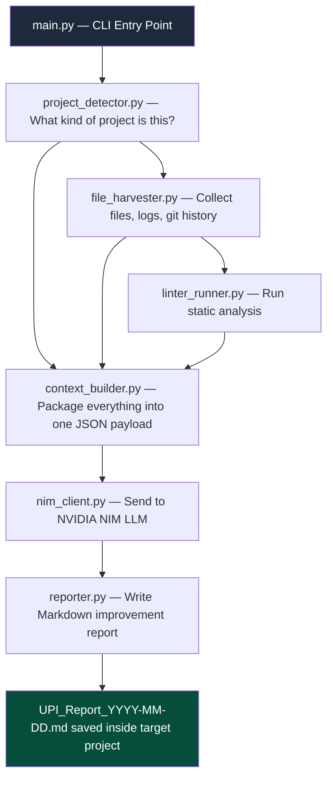

# Universal Project Improver — Architecture
## Zero-Config Scanner Pipeline & Component Map

---

## 1. System Architecture Diagram



---

## 2. Component Specifications

### A. `project_detector.py` — The Project Fingerprinter
This is the first thing that runs. It scans the root of the target project and identifies:

| It finds this file... | It concludes this... |
|---|---|
| `requirements.txt` or `pyproject.toml` | Python project |
| `package.json` | Node.js / JavaScript / TypeScript project |
| `go.mod` | Go project |
| `Cargo.toml` | Rust project |
| `pom.xml` or `build.gradle` | Java project |
| `*.sln` or `*.csproj` | C# / .NET project |
| None of the above | Generic / Unknown — still works, falls back to reading all text files |

It also reads `README.md` (if it exists) to extract a plain-English description of what the project does. This becomes part of the LLM context so the AI understands the *purpose* of the code before auditing it.

**Output:** A `ProjectProfile` dict:
```json
{
  "language": "Python",
  "framework_hints": ["FastAPI", "MT5", "OpenAI"],
  "description": "A parliamentary AI trading system for XAUUSD...",
  "has_git": true
}
```

---

### B. `file_harvester.py` — The Content Collector
Given the `ProjectProfile`, the harvester intelligently collects the most relevant content:

1. **Git History:** Runs `git log --oneline -30` to get the 30 most recent commits. This tells the AI what the developer has been working on and where bugs are being fixed.
2. **Hot Files:** Gets the 10 most recently modified source files (`.py`, `.js`, `.go`, etc.). These are statistically the most likely locations of new bugs.
3. **Log Files:** Walks the directory for `*.log`, `*.err`, `error*`, `crash*` files and reads the last 200 lines of each.
4. **Config Files:** Reads `.env` structure (keys only, **never values**), `config.json`, `settings.py`, etc.
5. **Documentation:** Reads `README.md`, `CHANGELOG.md`, `docs/*.md`.

**Token Budget Management:** The harvester tracks total character count across all collected content. If it exceeds the model's limit (~80,000 tokens), it prioritizes in this order:
1. Hot files (highest priority)
2. Recent log errors
3. Git history
4. Documentation (lowest priority — summarize if needed)

**Output:** A `HarvestedContext` dict with all raw content organized by category.

---

### C. `linter_runner.py` — The Static Analysis Runner
Runs the appropriate linter based on detected language using Python's `subprocess` module:

| Language | Linter Command |
|---|---|
| Python | `pylint --output-format=json {files}` or `ruff check {path}` |
| JavaScript/TypeScript | `npx eslint {path} --format json` |
| Go | `golangci-lint run {path}` |
| Unknown | Skip linting gracefully |

If the linter is not installed, it skips silently — it never crashes the pipeline. Linter output is summarized (top 20 issues by severity) before being added to the context.

---

### D. `context_builder.py` — The Payload Assembler
Takes all scanner outputs and assembles the final structured JSON payload that will be sent to the LLM. Applies final token truncation if needed.

---

### E. `nim_client.py` — The API Engine
- Connects to NVIDIA NIM using the OpenAI-compatible SDK.
- Implements exponential backoff retries (3 attempts, 5s → 15s → 45s wait).
- Supports model override via CLI or `.env`.
- Default model: `nvidia/llama-3.3-nemotron-super-49b-v1.5`.

---

### F. `reporter.py` — The Report Writer
- Receives raw Markdown from the LLM.
- Prepends a metadata header (timestamp, project name, model used).
- Saves the file as `UPI_Report_YYYY-MM-DD.md` in the **target project's root directory**.
- Optionally prints a summary to the terminal.

---

## 3. Data Processing Lifecycle

```
1. User runs:
   python main.py --project-path "C:/path/to/any/project"

2. project_detector.py scans the root folder
   → Identifies language, framework, reads README

3. file_harvester.py collects content
   → Hot files + logs + git history + config structure

4. linter_runner.py runs static analysis
   → Returns top issues by severity

5. context_builder.py assembles the full payload
   → Applies token budget management

6. nim_client.py sends payload to NVIDIA NIM
   → Using the Universal Improver system prompt

7. reporter.py writes the improvement report
   → Saved as UPI_Report_YYYY-MM-DD.md in the target project
```

---

## 4. What Is NOT in This Architecture (By Design)

- ❌ No project-specific adapters
- ❌ No `casa_config.json` required in the target project
- ❌ No hardcoded file paths
- ❌ No knowledge of trading, web apps, or any specific domain
- ✅ Pure file system intelligence + LLM reasoning
